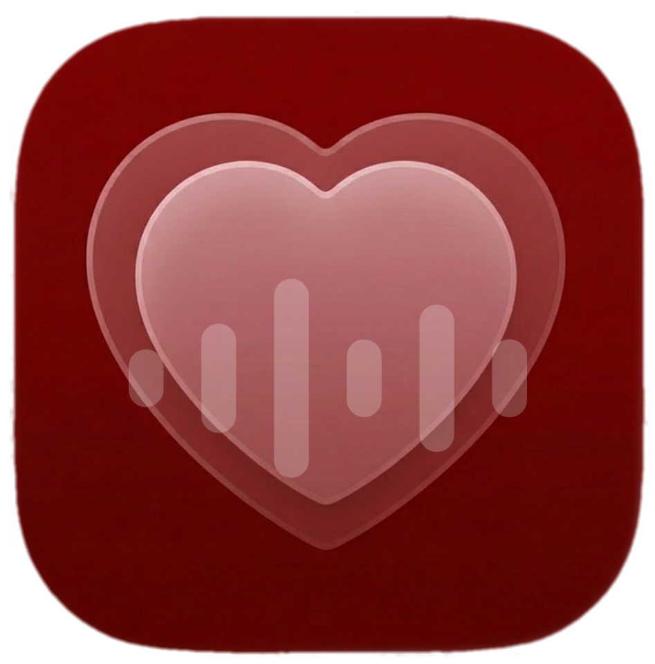
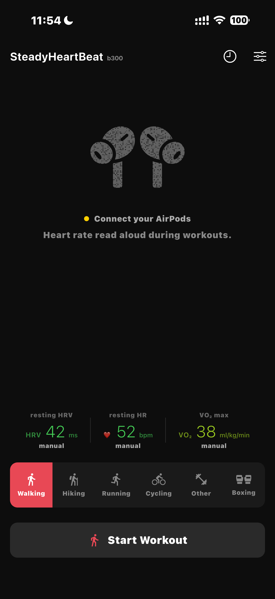
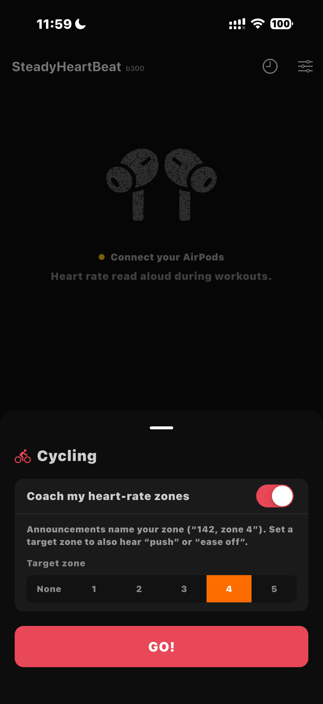
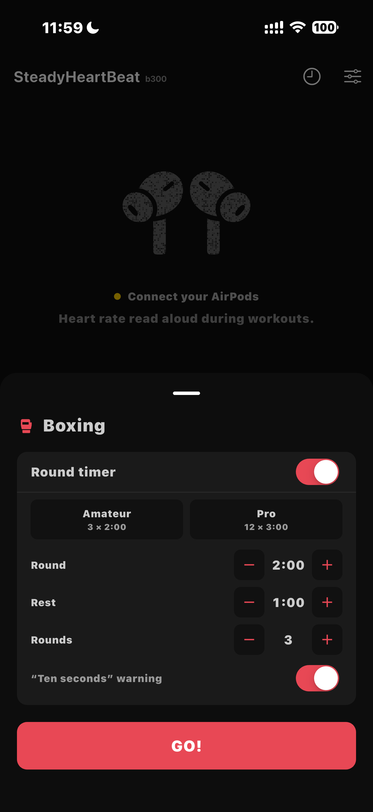
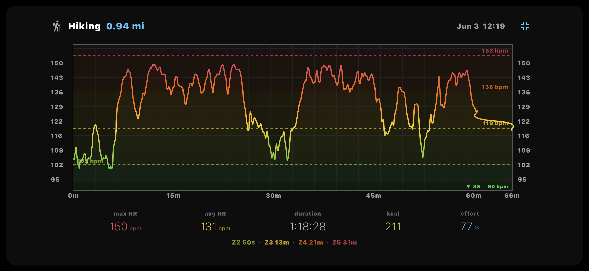
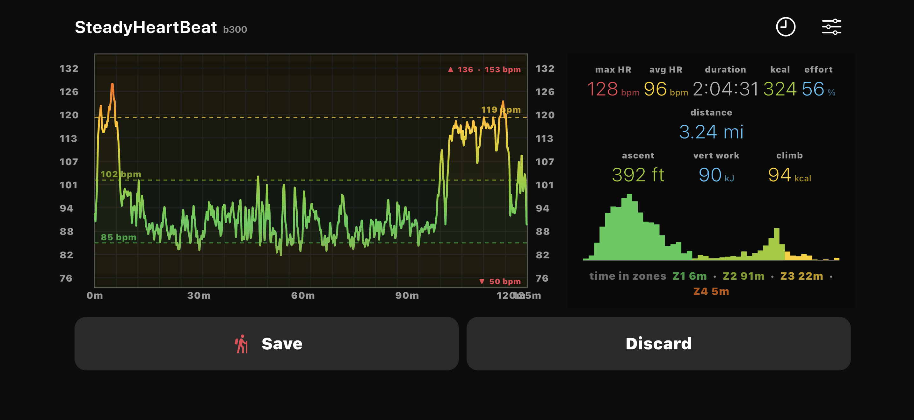

# SteadyHeartBeat



iOS app that reads heart rate from AirPods with heart rate monitoring via HealthKit and announces it aloud — no watch, no chest strap, eyes and hands free.

Built by [Halfmarble LLC](https://halfmarble.com) as a proof of concept for ambient on-device biometric feedback, and as a prior art vehicle for the consumer-earbud-as-closed-loop-biometric-sensor pipeline. It was also a testbed for what it actually takes to keep user data protected and never released — to prove we can deliver on the privacy we promise.

**Prior art published** — nine public-domain defensive publications in the Technical Disclosure Commons (Defensive Publications Series), so the methods stay freely practicable and cannot be patented by a third party. Full list in the *Prior art, code, and the app* section below.

---

## What it does

- **Voice announcements** — current BPM announced at a configurable interval (continuous / 2s / 5s / 15s / 30s / 1 min) and immediately when HR changes by a configurable threshold (±3 / ±5 / ±8 / ±10 BPM). Both triggers use independent baselines so interval announcements never suppress drift detection. Spoken by an on-device neural voice — see [The voice](#the-voice).
- **Live chart** — full-session HR history, chart fills the screen, auto-scales to the session's HR range. Chart time axis is at least 15 minutes and grows as the session continues.
- **5-zone color gradient** — the HR line is colored green (Zone 1 recovery) → chartreuse (Zone 2 fat burn) → yellow (Zone 3 aerobic) → deep orange (Zone 4 anaerobic) → red (Zone 5 maximum effort), with quadratic easing in the warning zone. Zone boundaries are computed automatically from your date of birth via the Tanaka formula (maxHR = 208 − 0.7 × age) read from Apple Health.
- **Zone coaching** — optionally name your training zone in each announcement ("142, zone 4"), and with a target zone set, append a steering nudge — "push" when you're below it, "ease off" when above. Composed on-device in the native layer so it keeps coaching while backgrounded with the screen off. Requires heart-rate zones (age or date of birth configured); falls back to the bare number otherwise.
- **Pre-workout readiness snapshot** — shows resting HR, HRV (SDNN), and VO₂ max from Apple Watch (when available), color-coded against **age-banded reference norms** (see [References](#references)), with data freshness timestamps.
- **Live metrics overlay** — current BPM centered on the chart with calories (yellow, right) and breathing rate (blue, left) as subscripts. In portrait, the BPM number drifts 1 px per sensor sample away from the heart rate line. In landscape, it's always dead center.
- **Workout type** — select Boxing 🥊, Cycling 🚴, Running 🏃, or Other before starting. Sets the correct `HKWorkoutActivityType` for Apple Fitness rings. Saving the finished workout to Apple Health is on by default and can be turned off in Preferences (**Apple Health → Save workouts to Apple Health**) — with it off, the workout is discarded and never leaves the device.
- **Boxing round timer** — for boxing workouts, an optional round timer with amateur (3 × 2:00) and pro (12 × 3:00) presets, plus configurable round length, rest length, and round count. Calls rounds and rest aloud through the same voice channel, with an optional "ten seconds" warning before each round ends.
- **Post-workout summary** — max HR, average HR (time-weighted), duration, calories, effort score (avg/maxHR × 100), zone time distribution, and a 1-BPM resolution HR histogram colored by zone.
- **Session history** — every completed session is saved as JSON to the app's Documents directory. Tap the clock icon in the app bar to browse past sessions with mini histograms.
- **Screen wakelock** — screen stays on during monitoring, returns to normal auto-lock when stopped.

---

## Screenshots

<table>
  <tr>
    <td align="center" width="33%"><br><sub>Pre-workout readiness — resting HRV, resting HR, VO₂ max — then pick a workout type</sub></td>
    <td align="center" width="33%"><br><sub>Set a target zone and hear "push" / "ease off" coaching as you train</sub></td>
    <td align="center" width="33%"><br><sub>Boxing round timer — amateur/pro presets, configurable rounds, rest, and "ten seconds" warning</sub></td>
  </tr>
</table>

The full-session HR chart fills the screen, colored by training zone (green recovery → red maximum effort) — turn the phone landscape. Below, the same hike recorded on two people:

<p align="center">
  <br>
  <sub>A higher-intensity profile — sustained Zone 4 with Zone 5 peaks (max 150, avg 131)</sub>
</p>

<p align="center">
  <br>
  <sub>A long aerobic effort bookended by two climbs (max 128, avg 96, over two hours)</sub>
</p>

---

## Hardware requirement

Requires **AirPods with heart rate monitoring** (AirPods Pro 3 or later) and iOS 26 or later. Heart rate monitoring requires `HKWorkoutSession` on iPhone, which is only available on iOS 26+.

---

## The voice

Announcements are spoken by **Kokoro-82M** — an open-weight neural text-to-speech model (Apache-2.0, built on StyleTTS 2) that runs entirely on the iPhone. Nothing to download, nothing to configure, no network at any point.

What the app can say is a closed set — a heart rate, a training zone, a nudge, a round number, and a handful of fixed phrases — so it ships **pre-rendered** in that voice as ~5 MB of audio. The renderer is in the repo: `scripts/kokocli.swift -corpus` regenerates the whole set from the same weights the live tier uses (build instructions are in its header; note that Core ML synthesis is not run-to-run deterministic, so a re-render is equivalent, not identical). Anything outside that set is synthesized live on-device through Core ML (CPU and Neural Engine only — iOS will not run GPU work from a backgrounded app, and this app speaks while backgrounded).

Apple's **Ava (Premium)** remains as a fallback for the rare case where a cue is not in the corpus and a neural render fails. There is no voice setting: the app speaks in one voice, and offering a choice would have meant offering voices that sound worse or take a minute to warm up mid-workout.

---

## Architecture

```
AirPods Pro 3 optical sensor
        │
        ▼
 HKWorkoutSession / HKLiveWorkoutBuilder
 (iOS HealthKit — on-device only)
        │
   ┌────┴────┐
   │         │
 Heart    Respiratory     Active
 rate       rate         calories
   │         │               │
   └────┬────┴───────────────┘
        │
   WorkoutProvider (Dart)
        │
   ┌────┴──────────────────────┐
   │                           │
Voice TTS                  Live chart
(Kokoro, on-device)        + overlay
   │                           │
   └─────────AirPods───────────┘
         (same device)
```

All computation is on-device. No data leaves the iPhone — halfmarble never receives it. Session files are stored in the app's private Documents directory and are explicitly excluded from iCloud/iTunes backup, so they stay on the device.

---

## Prior art, code, and the app — three separate layers

These are deliberately **independent** decisions. A change to one does not affect the others:

1. **Prior art (public domain).** Selected *methods and techniques* are disclosed as dated,
   public-domain **defensive publications**, deposited in the [Technical Disclosure
   Commons](https://www.tdcommons.org) Defensive Publications Series so a patent examiner can
   actually find them (a self-published README is not examiner-searched):

   | Disclosure | TDCommons |
   |---|---|
   | Consumer earbud as a closed-loop biometric sensor and ambient feedback device — [PRIOR_ART_EARBUD_CLOSED_LOOP.md](PRIOR_ART_EARBUD_CLOSED_LOOP.md) | [10440](https://www.tdcommons.org/dpubs_series/10440) |
   | Heart-rate-recovery-gated rest-interval timing — [PRIOR_ART_REST_GATING.md](PRIOR_ART_REST_GATING.md) | [10441](https://www.tdcommons.org/dpubs_series/10441) |
   | Crediting recorded prior activity toward an exercise warm-up — [PRIOR_ART_WARMUP_READINESS.md](PRIOR_ART_WARMUP_READINESS.md) | [10439](https://www.tdcommons.org/dpubs_series/10439) |
   | Synchronized multi-line digital signal generation (USB D−/D+) | [10442](https://www.tdcommons.org/dpubs_series/10442) |
   | Robust overnight HRV estimation independent of sleep/wake staging | [10443](https://www.tdcommons.org/dpubs_series/10443) |
   | Nap-level HRV and nap-day recovery comparison | [10454](https://www.tdcommons.org/dpubs_series/10454) |
   | Active-sleep (dream-enactment) burden over a staging-independent in-bed window | [10455](https://www.tdcommons.org/dpubs_series/10455) |
   | Per-session sleep onset latency, two-tailed | [10494](https://www.tdcommons.org/dpubs_series/10494) |
   | Privacy-preserving population and cohort biometric histograms (on-device DP + secure aggregation) | [10495](https://www.tdcommons.org/dpubs_series/10495) |

   Publishing them as prior art keeps them freely practicable by anyone and prevents third parties
   from patenting them. That is their only purpose — they do **not** give away the source code or
   the application.
2. **Code license.** The *source code* is governed separately by **[LICENSE](LICENSE)** (Apache 2.0), and may be relicensed in future without affecting the prior-art dedication above. Third-party components — the Kokoro-82M voice and the Swift code vendored with it — are attributed in **[NOTICE](NOTICE)**.
3. **The application.** *SteadyHeartBeat the product* — its distribution, pricing, and availability — is a halfmarble product decision, independent of the two layers above.

So: the **ideas** are public-domain prior art, the **code** has its own license, and the **app** is a product. Publishing the prior art secures the defensive goal (unpatentability) **without** requiring the app to be free or the code to be open.

---

## Building

Requires a physical iPhone (HealthKit and HKWorkoutSession are unavailable in Simulator). Minimum deployment target: iOS 26.0.

```bash
flutter pub get

# Builds the Kokoro Core ML weights + voice packs into ios/Runner/KokoroAssets/
# (234 MB, gitignored). Run this once per clone — the Xcode project references
# those paths and the build fails without them. The pre-rendered clips are in
# the repo already, so the app has its voice either way; this is the live
# synthesis tier.
ios/get-kokoro-coreml.sh

flutter run --device-id <your-device-id> --release
```

After changing `ios/Runner/Runner.entitlements`, confirm the HealthKit capability is enabled in Xcode under Signing & Capabilities for both Debug and Release.

---

## References

All physiological thresholds are deterministic and traceable to published science (no opaque models). The metric grading lives in [`lib/health_norms.dart`](lib/health_norms.dart).

- **Max heart rate / zones** — Tanaka formula, `maxHR = 208 − 0.7 × age`. Tanaka H, Monahan KD, Seals DR. *Age-predicted maximal heart rate revisited.* J Am Coll Cardiol. 2001;37(1):153–156. [doi:10.1016/S0735-1097(00)01054-8](https://doi.org/10.1016/S0735-1097%2800%2901054-8)
- **VO₂ max grading** — age- **and sex-banded** norms from the American College of Sports Medicine / Cooper Institute *Aerobics Center Longitudinal Study* (decade percentiles by sex; "excellent" ≈ 80th, "good" ≈ 60th, "fair" ≈ 40th). Biological sex is read from HealthKit (with a manual override in Preferences); it defaults to men's norms when unknown. ACSM. *ACSM's Guidelines for Exercise Testing and Prescription*, 11th ed. Wolters Kluwer; 2021.
- **Resting HRV (SDNN) grading** — age-banded short-term reference ranges (age-only; SDNN sex differences are small and inconsistent). Sammito S, Böckelmann I. *Reference values for time- and frequency-domain heart rate variability measures.* Heart Rhythm. 2016; and short-term (5-min) HRV reference ranges from the **Multi-Ethnic Study of Atherosclerosis (MESA)**. [PMC5010946](https://pmc.ncbi.nlm.nih.gov/articles/PMC5010946/)
  - *Measurement-validity caveat:* consumer-wearable HRV is supported only at the **device-class** level. It is markedly less reliable than heart rate; the reference ranges above were **not** derived from Apple Watch; validated wearables typically report **rMSSD**, not the **SDNN** Apple exposes; and no study has validated Apple Watch HRV specifically, nor in a Parkinson's/RBD cohort. Treat the grade as a coarse **within-person trend**, not a validated readout.

---

## Privacy

All processing is on-device — halfmarble never receives your data, and nothing is sent to any server. Your session files and personal health data (age, sex, self-reported conditions, and biometric values) stay in the app's private storage and are excluded from iCloud/iTunes backup. App settings (voice, intervals, units) are the only thing kept in standard preferences.

The one exception is **Apple Health**: by default each finished workout is saved there for your Activity rings, after which it follows your own iCloud Health sync settings. You can turn that off in Preferences (**Apple Health → Save workouts to Apple Health**), and the workout will stay on this device only.

**Your data is yours — locked in is not the goal.** Protecting data this aggressively has a failure mode: it can lock out the owner too. So **Preferences → Your Data** gives you two unconditional actions: **Export My Data** — a complete, readable copy of everything the app stores (sessions and health profile), handed over through the system share sheet to a destination you choose — and **Delete All Data**, which erases it from the device. The export sheet also offers **Anonymize for Research…**, which produces a de-identified copy (random IDs, identity and absolute timestamps stripped) if you choose to donate it. Nothing uploads anywhere; both paths end at the share sheet. A readable export is deliberate: an encrypted one would protect the data from its owner as much as from anyone else, which is the opposite of stewardship.

For a complete breakdown of every way data could leave the device and how each is handled — verifiable against the code — see **[DATA_PRIVACY.md](DATA_PRIVACY.md)**. The full privacy policy is at [halfmarble.com/steadyheartbeat/privacy.html](https://halfmarble.com/steadyheartbeat/privacy.html).

---

*Halfmarble LLC — [halfmarble.com](https://halfmarble.com) — privacy@halfmarble.com*
